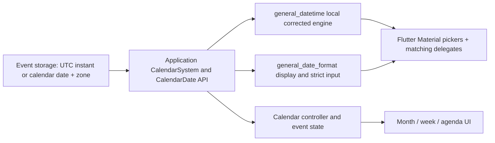

# Review of general_datetime and general_date_format

Reviewed 2026-10-03 for use as the logic and UI foundation of a calendar application.

Follow-up work is tracked in [CALENDAR_ISSUES_CHECKLIST.md](CALENDAR_ISSUES_CHECKLIST.md).
The observations below describe the reviewed snapshot; fixes are recorded in
the checklist rather than rewriting the original evidence.

**Decision: adopt the corrected local implementations behind an application-owned calendar API, after addressing the blockers below. Do not adopt the currently resolved published general_datetime 2.1.0 as the core.** The local conversion engine is substantially stronger than the published dependency. These packages provide calendar dates, formatting, parsing, and Flutter Material date-picker integration; a complete calendar application still needs its own date-only model, navigation policies, event model, timezone handling, and UI state.

## Scope and verified results

Reviewed public exports, both date classes, conversion/data helpers, interfaces, calendar delegates, default and multilingual Material localizations, formatter/parser internals, locale tables and their generator, examples, tests, manifests, workflows, and validation documents. Generated locale data was assessed through source inspection, all-locale test execution, and additional locale probes rather than a new independent translation audit of every string.

| Item | Observed result |
| --- | --- |
| Local general_datetime | 165/165 existing tests passed; analyzer clean |
| Local formatter with its normal hosted datetime dependency | 488/488 existing tests passed; analyzer clean |
| Formatter suite copied into an isolated harness using both neighboring local packages | 488/488 existing tests passed |
| Additional local probes | Reproduced the findings below; observation probes passed after correcting the harness itself |
| Additional Persian/Hijri range dialogs | 2/2 passed: Persian locale, calendar mode, input mode, and returned date types/instants |
| Historical Tehran assertions | 37/37 critical tests passed with CALENDAR_TEST_TZ=Asia/Tehran |
| Source formatting | Both repository checks passed with zero formatting changes |
| Formatter example, initial snapshot | 3/3 tests passed |
| Formatter example, final working-tree snapshot | 1 passed, 2 failed after its sample dates changed to now() during the review |
| Chrome smoke test | Stalled at loading without reaching assertions; stopped. Browser behavior remains unverified |

Environment: installed Flutter 3.47.5, Dart 3.13.4, Windows; normal formatter resolution uses intl 0.20.3. UTC/New York CI jobs, Flutter 3.32, Android/iOS device execution, release performance, and browser/Wasm precision were not independently verified in this review.

The reviewed commits were general_datetime `c842606` and general_date_format `f2deb5f`, with working-tree changes. The existing general_datetime analysis_options.yaml change was preserved. The formatter example/lib/main.dart changed during the review and was preserved. No package implementation or normal dependency manifest was changed by this audit. This report and ignored audit harnesses/logs were added.

## Package overview

| Responsibility | general_datetime | general_date_format |
| --- | --- | --- |
| Gregorian dates | Native Dart DateTime | Formats/parses native DateTime |
| Persian dates | PersianDateTime, conversion, normalization, epoch/instant operations | Calendar-specific names, patterns, digits, parsing |
| Hijri dates | HijriDateTime using finite Umm al-Qura data in local source | CLDR-backed month/era names, formatting/parsing |
| Calendar math | Leap status, month/year lengths, day of year, Julian day, field normalization | Delegates construction and validation to datetime |
| Flutter integration | PersianCalendarDelegate, HijriCalendarDelegate; English default Material localizations | Translated Material localizations with date/number adapters |
| Custom calendars | Interface exists, but construction helpers are hard-coded | Explicitly supports only Gregorian, Persian, Hijri |
| Complete calendar UI | Supplies adapters to Flutter's Material pickers | Supplies localization; no agenda/event/week-view implementation |

The local date classes extend DateTime but expose calendar-specific year/month/day fields. Their inherited native instant is now the actual Gregorian instant, with UTC/local representation and microseconds retained. Comparisons and duration arithmetic use that instant. CalendarDelegate operations instead reconstruct calendar fields and reset time for picker navigation.

The formatter selects the calendar from the runtime date type. Locale selects language, patterns, and digits; locale does not convert a Gregorian value into Persian or Hijri. Parsing uses a sample date as a calendar selector and returns a DateTime-typed result. The selector's date fields do not become parse defaults; missing fields use the Gregorian epoch represented in the chosen calendar.

Material integration has two choices: general_datetime's English-only Default... localizations, or general_date_format's multilingual delegates. The latter preserve Flutter translations and plug calendar formatters and number adapters into Material localizations. One Material localization delegate is active in each scope, so each calendar picker needs the matching scope.

### Chronology and supported ranges

| Calendar | Local supported years | Data/model policy |
| --- | --- | --- |
| Gregorian | Native DateTime range | Native Dart behavior |
| Persian | SH -61 through 3177, including year zero | University of Tehran published leap data for 1206–1498; Borkowski calculation elsewhere |
| Hijri | AH 1300 through 1600 | ICU/OpenJDK Umm al-Qura month table; no tabular fallback |

Gregorian endpoints are 0560-03-20 through 3799-03-19 for Persian, and 1882-11-12 through 2174-11-25 for Hijri. Bounds apply to the represented wall date; timezone conversion or arithmetic can legitimately throw when the resulting calendar date leaves the supported range. minimumGregorianDate/maximumGregorianDate represent endpoint dates at UTC midnight, not inclusive instant bounds for every timezone.

The Persian suites exercise all 1,183,020 supported days against external year starts and 107,016 published-data days against separate fixtures. The Hijri suite exercises all 106,665 supported days against a separately represented fixture. Those tests passed in this review. The documented primary-source hashes and earlier external validation were inspected; all source PDFs and every upstream dataset were not downloaded and re-audited here.

### Strengths worth retaining

- Finite ranges and explicit failure instead of silently switching algorithms.
- Clear distinction between Persian published-data coverage and calculated coverage.
- Preservation of microseconds, UTC/local mode, epochs, equality/hashing, and cross-calendar conversion in the local date engine.
- Broad normalization, endpoint, precision, DST, parsing, and picker coverage.
- Locale-specific digits, ASCII/native input support, strict/loose parsing, named skeletons, quoting, and cache invalidation in the formatter.
- Generated Hijri translations with a pinned CLDR source and third-party notice.
- Picker-scoped localization and explicit unsupported-calendar/timezone-pattern errors.

## Confirmed issues and integration hazards

P1 means resolve before adoption; P2 means a reproducible defect or material integration risk; P3 means a lower-priority contract/maintenance concern. Some findings are deliberate API behavior that becomes hazardous at an application boundary; these are identified explicitly.

### 1. P1 — The normal dependency selects the old, defective implementation

Sources: [formatter pubspec](D:/StudioProjects/general_date_format/pubspec.yaml:25), [.dart_tool resolution](D:/StudioProjects/general_date_format/.dart_tool/package_config.json:65), [datetime changelog](D:/StudioProjects/general_date/CHANGELOG.md:3).

general_date_format resolves hosted general_datetime 2.1.0 from the Pub cache. The neighboring corrected source is also numbered 2.1.0. Both changelogs list the major fixes under Unreleased. Installing the documented version constraint therefore does not obtain the reviewed local engine.

Separate probes against the resolved hosted dependency produced:

```text
HijriDateTime.fromDateTime(DateTime.utc(2024, 12, 2)) -> 1446-06-00
HijriDateTime.fromDateTime(DateTime.utc(2026, 10, 3)) -> 1448-05-0-9
HijriDateTime.utc(1446, 9, 1, ...) -> isUtc == false
Persian value == its native equivalent -> false
native equivalent == Persian value -> true
```

The local code fixes these core contracts. The formatter's hosted-Hijri UTC workaround addresses one symptom, not chronology or asymmetric equality. Its 488 passing tests primarily validate formatting against the dependency's own selected calendar behavior, so they cannot certify the old dependency's calendar accuracy.

Action: release coordinated new versions, require the corrected datetime version from the formatter, and verify the installed application resolves them. Until then, pin the reviewed source revision/path in application development.

### 2. P1 — DateTime subclassing permits silent Gregorian reconstruction

Sources: [Persian subclass](D:/StudioProjects/general_date/lib/src/persian_date_time.dart:20), [copyWith](D:/StudioProjects/general_date/lib/src/persian_date_time.dart:438); same pattern in HijriDateTime.

For PersianDateTime.utc(1403, 1, 1), the native date is 2024-03-20. But:

```dart
DateTime date = PersianDateTime.utc(1403, 1, 1);
date.copyWith(day: 2); // native Gregorian 1403-01-02, not Persian 1403-01-02
DateUtils.dateOnly(date); // native Gregorian 1403-01-01
```

The concrete calendar class's copyWith works; a variable statically typed DateTime invokes Dart's extension, which constructs a native DateTime from the overridden fields. The same hazard affects external helpers that reconstruct dates from year/month/day. This is reproducible with both local classes and is not fixed by correct epoch storage. [Dart's documented copyWith implementation](https://api.dart.dev/dart-core/DateTimeCopyWith/copyWith.html) explains the behavior.

Action: centralize calendar field operations in an application adapter and convert to a native Gregorian DateTime before calling generic Gregorian helpers. Prefer composition and a date-only calendar value for the long-term domain API, retaining DateTime subclasses at the Flutter compatibility boundary if needed.

### 3. P1 — Calendar delegates accept incompatible runtime date types

Sources: [Persian dateOnly/monthDelta](D:/StudioProjects/general_date/lib/src/delegates/persian_calendar_delegate.dart:14), [Hijri dateOnly/monthDelta](D:/StudioProjects/general_date/lib/src/delegates/hijri_calendar_delegate.dart:14).

Both extend CalendarDelegate<DateTime> and directly read year/month/day. A native Gregorian 2024-03-20 becomes Persian year 2024 rather than SH 1403. A native Gregorian 2025 date passed to Hijri dateOnly throws because AH 2025 is unsupported. monthDelta and inherited day/month comparisons similarly operate on incomparable calendar fields when types are mixed.

The README asks callers to supply matching types, but the public type accepts the invalid inputs. This can silently shift a date or crash at a UI boundary.

Action: use typed delegate generics where practical, or validate every date input and clearly reject/explicitly convert mismatches. Apply one consistent policy to dateOnly, month/day navigation, comparisons, and parsing results.

### 4. P2 — Direct YearPicker needs an explicit matching currentDate

Source: delegates above; installed Flutter calendar_date_picker.dart:1400.

Flutter's direct YearPicker constructor supplies native DateTime.now() when currentDate is omitted, then calls the provided delegate's dateOnly. With HijriCalendarDelegate, constructing it currently throws RangeError for Gregorian year 2026. Persian receives an incorrect current calendar year. CalendarDatePicker uses calendarDelegate.now() and does not have this particular default problem.

Action: provide PersianDateTime.now()/HijriDateTime.now() when constructing YearPicker, document this, and add a regression. Consider a safe package wrapper; improving delegate input handling also addresses the hazard.

### 5. P1 integration hazard — Calendar ISO-like output is unsafe as a generic storage timestamp

Sources: [Persian ISO output](D:/StudioProjects/general_date/lib/src/persian_date_time.dart:487), [Hijri ISO output](D:/StudioProjects/general_date/lib/src/hijri_date_time.dart:482).

toIso8601String() deliberately writes Persian/Hijri fields. A Persian value whose instant is 2024-03-20 produces 1403-01-01T...Z. Native DateTime.parse and typical backend ISO parsers interpret that year as Gregorian 1403. The string contains no calendar identifier.

Action: persist timed events using native Gregorian UTC ISO/epoch values, with calendar identifier and timezone metadata separately. Persist all-day calendar dates as explicit calendar/year/month/day records. Reserve these calendar-specific strings for a matching calendar parser or clearly tagged transport schema.

### 6. P2 — Strict parsing silently replaces conflicting date fields

Sources: [DateBuilder verify/construction](D:/StudioProjects/general_date_format/lib/src/date_builder.dart:71), [parseQuarter](D:/StudioProjects/general_date_format/lib/src/date_format_field.dart:695).

Observed Gregorian examples, also applicable to the shared parser's custom calendars:

| Pattern and input | Strict result |
| --- | --- |
| yyyy-MM-dd EEEE / 2024-01-15 Sunday | Accepts January 15, which is Monday |
| yyyy-MM-dd Q / 2024-01-15 4 | October 1: quarter overwrites month and day |
| Q yyyy-MM-dd / 4 2024-01-15 | January 15: later fields overwrite quarter |
| yyyy-MM-dd D / 2024-01-15 100 | April 9: ordinal day replaces month/day |
| yyyy-MM-dd D / 2024-01-99 100 | Accepts April 9 despite supplied day 99 |

Weekdays are consumed without verification, quarter setters mutate month/day, and ordinal verification skips supplied day/month correspondence. These may resemble permissive parser conventions, but parseStrict currently gives no indication that redundant fields are discarded.

Action: retain all supplied constraints and check their consistency in strict mode, or reject unsupported conflicting patterns. Document a compatibility choice if redundant weekday validation intentionally remains permissive.

### 7. P2 — Repeated time fields can bypass strict range checks

Sources: [setPatternHour](D:/StudioProjects/general_date_format/lib/src/date_builder.dart:61), [hour validation](D:/StudioProjects/general_date_format/lib/src/date_builder.dart:71).

Pattern yyyy-MM-dd HH HH accepts 2024-01-15 25 01 and returns hour 1. Only the final hour and its input range survive. Earlier invalid or conflicting tokens are discarded.

Action: reject duplicate semantic fields in strict patterns or validate each occurrence and require agreement. Cover repeated year/month/day/minute/second/day-period tokens as well as hours.

### 8. P2 — AM/PM is applied to 24-hour tokens

Sources: [hour24](D:/StudioProjects/general_date_format/lib/src/date_builder.dart:69), [parseAmPm](D:/StudioProjects/general_date_format/lib/src/date_format_field.dart:559).

Pattern HH:mm a accepts 01:00 PM as 13:00. Its own output for 13:00 is 13:00 PM, which the parser attempts to turn into hour 25; strict parsing rejects that otherwise formatted value. AM/PM should not blindly add 12 to an H/k hour.

Action: retain hour-cycle information, apply day periods only to h/K, and either validate or explicitly reject mixed 24-hour/day-period patterns.

### 9. P2 — Numeric c/cc returns day of month, not weekday

Source: [formatStandaloneDay](D:/StudioProjects/general_date_format/lib/src/date_format_field.dart:581).

For Monday 2024-01-15, both c and cc format as 15. Numeric parsing also consumes the value without weekday validation. This conflicts with the claimed ICU-style pattern model: c represents the locale's standalone weekday number, in the range 1–7. See [Unicode's date field table](https://www.unicode.org/reports/tr35/tr35-dates.html#Date_Field_Symbol_Table).

Action: compute the weekday relative to locale FIRSTDAYOFWEEK; implement corresponding parsing rules and update the misleading pattern documentation.

### 10. P2 — Script/region fallback drops valid script information

Sources: [locale helpers](D:/StudioProjects/general_date_format/lib/src/helpers.dart:20), [Material locale selection](D:/StudioProjects/general_date_format/lib/src/localizations/calendar_material_localizations.dart:38).

sr_Latn is supported, but sr_Latn_RS falls back to sr and renders Cyrillic rather than Latin. zh_Hant and zh_Hant_HK fall back to zh, while existing zh_TW/zh_HK data provides traditional Chinese. Material locale selection also falls directly from the complete locale name to its language code, allowing translated Flutter labels and calendar strings to use different scripts.

Action: normalize BCP-47 language/script/region components and resolve exact locale, language+script, suitable region aliases, then language. Reuse that resolver for formatters and Material date/number adapters.

### 11. P2 — Persian Afrikaans locale contains Persian language data

Source: [af symbol block](D:/StudioProjects/general_date_format/lib/src/symbols/jalali_symbol_data_local.dart:151).

For locale af, Persian MMMM EEEE a produces فروردین چهارشنبه ب.ظ. The locale includes Persian weekday names and day-period strings, not Afrikaans ones. Picker narrow weekday headers are also Persian; Flutter's Afrikaans headers are [S, M, D, W, D, V, S].

The additional convention comparison also found en_MY week-start data differs from the installed Flutter data: Persian Monday versus Flutter Sunday. This warrants source reconciliation. en_ISO also differs, but its deliberate ISO Monday convention should be treated separately.

Action: correct af; give the Persian symbol data an authoritative source and reproducible generator/checks, as already done for Hijri. Review locale-neutral weekday/time/week metadata against the selected CLDR version. Existing round-trip tests verify self-consistency, not translation correctness.

### 12. P2 — Oversized wall-clock fields overflow into ordinary valid dates

Sources: [Persian time accumulation](D:/StudioProjects/general_date/lib/src/persian_date_time.dart:526), [Hijri time accumulation](D:/StudioProjects/general_date/lib/src/hijri_date_time.dart:522).

On the native VM, both of these return the ordinary midnight date:

```dart
PersianDateTime.utc(1403, 1, 1, 0, 0, 288230376151711744);
HijriDateTime.utc(1446, 9, 1, 0, 0, 288230376151711744);
```

Multiplication by microseconds per second wraps at int64 before range checking. The recent epoch-constructor overflow fix does not protect general field accumulation. Extreme month/day arithmetic also needs an overflow audit.

Action: check arithmetic before multiplication/addition, or use an intermediate representation that cannot wrap, then check final supported bounds. Keep ordinary negative/overflow normalization.

### 13. P2 — Public dateSymbols exposes shared mutable data

Sources: [dateSymbols getter](D:/StudioProjects/general_date_format/lib/src/general_date_format.dart:803), [mutable DateSymbols](D:/StudioProjects/general_date_format/lib/src/date_symbols.dart:4).

Replacing one formatter's dateSymbols.MONTHS list changes another newly created formatter's output for the same locale/calendar. The probe changed month 1 to CORRUPTED and another instance rendered 1403 CORRUPTED. Individual constant lists resist element mutation, but the object fields remain assignable; deserialized lists can also be mutable.

Action: expose immutable symbol views/copies or explicit per-instance customization. A caller reading month names for a calendar header should not be able to alter unrelated formatting globally.

### 14. P3 — Negative secondsSinceEpoch has an unclear rounding contract

Sources: [Persian secondsSinceEpoch](D:/StudioProjects/general_date/lib/src/persian_date_time.dart:431), [Hijri equivalent](D:/StudioProjects/general_date/lib/src/hijri_date_time.dart:426).

The getter first obtains native milliseconds and then uses truncating ~/1000. At -1 microsecond it returns 0, at -999999 microseconds it returns -1, and at -1000001 microseconds it returns -1. This combines millisecond rounding with second truncation and is not consistent floor or truncation directly from microseconds.

Action: choose and document the unit-reduction policy; compute it directly from microseconds and test negative fractional-second boundaries. Prefer retaining microseconds/DateTime for event storage.

### 15. P2 — Current example tests no longer match its dynamic dates

Sources: [example dates](D:/StudioProjects/general_date_format/example/lib/main.dart:34), [fixed test expectations](D:/StudioProjects/general_date_format/example/test/widget_test.dart:18).

During this review, the three fixture dates changed to now(). Tests still require ۱۴۰۳/۰۱/۰۱, Farvardin, and Ramadan. The final snapshot fails the display and Persian-picker tests. The remaining Hijri test passing does not repair the nondeterministic assumptions.

Action: inject an example clock/date source and freeze it in tests, or derive expectations from a single captured reference instant. Create all three displayed calendars from one native instant; three independent now() calls can disagree near midnight. No example source was changed by this review.

## Architecture gaps and maintenance risks

These are missing capabilities or verification gaps, not evidence that ordinary conversions are wrong.

### 16. P2 — The date core is coupled to Flutter

Both pubspecs require the Flutter SDK; the formatter public library also exports Flutter localization code. The date engine itself is mostly plain Dart, but the package boundary makes reuse by a standalone backend/CLI harder.

Action: if your calendar will share logic with a server or Dart service, split a pure Dart chronology/date module from Flutter picker/localization adapters. For a Flutter-only app this is less urgent.

### 17. P2 — No complete extensible calendar contract

[GeneralDateTimeInterface](D:/StudioProjects/general_date/lib/src/general_date_time_interface.dart:3) omits common year/month/day/isUtc/copyWith/validity/range/factory contracts, and its generic now<T>() returns a raw interface and recognizes only Persian/Hijri. [Formatter registration](D:/StudioProjects/general_date_format/lib/src/general_date_format_internal.dart:10) similarly hard-codes those runtime types and rejects other implementations.

Action: define a CalendarSystem/CalendarDate adapter with construction, conversion, strict validity, bounds, month lengths, civil-day/month navigation, and calendar identity. Add a registry only if more calendars are actually planned. The existing interface alone does not deliver the manifest's broad custom-calendar claim across both packages.

### 18. P2 — Calendar periods and date-only values are missing

add/subtract accept elapsed Duration; copyWith normalizes overflow. There is no date-only value, addMonths/addYears with a documented clamp/reject/overflow policy, inclusive day-count operation, or week-number convention. Delegate addMonths resets the day to 1 and is specifically month-page navigation.

For example, changing a Persian month while retaining day 31 can overflow a 30-day destination month. Adding Duration(days: 1) is 24 elapsed hours and may change wall-clock time on historical DST days. Neither behavior is itself a bug, but neither is a complete calendar scheduling policy.

Action: add application-level civil-day and month/year operations with explicit policy, and model all-day dates separately from timed instants. Correct the datetime README's claim that duration operations work directly on calendar fields; the current implementation uses native instant arithmetic.

### 19. P2 — Timezone and scheduling capabilities need another layer

UTC and host-local time are supported. Named IANA zones, retained input offsets, user-selected zones, ambiguity policy for repeated times, recurring events, reminders, business-day/holiday rules, and event conflict handling are absent. The formatter explicitly rejects z/Z/v; it retains milliseconds in fractional output and discards microseconds on parsing. Formats such as SSSSSS append zeros rather than preserve the date engine's microseconds.

Action: define event timezone/recurrence policies separately. Use the formatter for display and validated date input, and native instant serialization for storage. Decide whether Umm al-Qura is the intended Hijri chronology; observed/religious/local Hijri calendars can have different dates. Keep Persian calculated coverage visibly distinct from published coverage when exposing distant dates.

### 20. P2 — A full calendar UI is outside both packages' scope

They do not implement week/day agendas, event tiles, overlap layouts, drag/reschedule, selection controller/state, multi-calendar overlays, asynchronous event loading, or custom month grids. Flutter supplies the Material picker widgets; these packages adapt their chronology and localization. See [Flutter CalendarDelegate's scope](https://api.flutter.dev/flutter/material/CalendarDelegate-class.html).

Action: own a calendar UI/controller layer and consume these packages through the adapter. Pickers can be reused directly with matching date values and localizations. Add dedicated keyboard, screen-reader, large-text, RTL, responsive-layout, and your intended event-view tests; rendering/input tests alone do not establish those properties.

### 21. P2 — CI does not verify the corrected package pair or minimum/platform matrix

The formatter workflow resolves its hosted dependency; the local override is documented for manual use. Therefore its CI does not test the corrected neighboring datetime source. Both workflows track one stable Flutter channel; neither proves the declared minimum Flutter version, browser/Wasm behavior, or device behavior. Formatter timezone tests have conditional expectations, while the core workflow explicitly asserts the requested zone.

Action: add a coordinated integration job for the exact source/release pair, minimum/current Flutter jobs, a browser smoke/regression suite, and explicit timezone assertions for formatter jobs. Retain the current exhaustive native suites. The review's copied local suite proves current integration once, not continuing CI coverage.

### 22. P3 — Locale data and adapter maintenance have measurable scope

The Persian symbol file is approximately 373 KB, Hijri generated data 187 KB, and common pattern table 241 KB of source, in addition to intl data. Hijri symbols initialize the complete locale map and Gregorian symbols derive digit defaults from Persian data. Patterns are a shared manually maintained table; Persian symbols lack the same documented generator provenance as Hijri.

Default Material localizations duplicate large portions of Flutter's English implementation. The multilingual number adapter implements NumberFormat through noSuchMethod and only supports format. This works for the installed framework, but needs compatibility coverage if Flutter uses additional NumberFormat methods.

Action: measure release startup/memory/bundle size before optimizing; source size is not final binary size. Use reproducible CLDR generation and immutable shared data, and test Flutter API compatibility. Keep adapter internals private. No performance regression was measured here.

## Recommended application boundary



Use four explicit concepts: calendar identity, a date-only calendar value, a native timed instant, and a timezone/presentation context. Make conversions explicit at their boundaries. Avoid using a DateTime-typed custom-calendar object as an unrestricted application-domain value.

A small adapter should expose strict construction; to/from native Gregorian instant; supported/published bounds; month length; civil-day addition; month/year addition with policy; same-day comparison; week-start/weekend policy; and formatting/parser creation for a chosen calendar and locale. Keep UI/controller state and event data independent of localization state.

For your immediate Gregorian/Persian/Umm al-Qura Flutter calendar, the local packages already provide a strong conversion and picker base. They need no wholesale algorithm rewrite. The priorities are:

1. Publish/pin the corrected engine and coordinate formatter resolution; remove dependence on the defective hosted chronology.
2. Guard date-type and serialization boundaries; introduce date-only and civil-period policies.
3. Fix strict parsing, hour-cycle/c semantics, script fallback, af data, and constructor overflow; add targeted regressions.
4. Repair deterministic example tests and automate testing of the exact package pair.
5. Verify browser/minimum SDK/accessibility and build the calendar controller/event UI layer.

## Reproduction artifacts

- [Local combined harness](D:/StudioProjects/general_date_format/.dart_tool/calendar_core_audit/pubspec.yaml)
- [Core/parser/interop probes](D:/StudioProjects/general_date_format/.dart_tool/calendar_core_audit/test/audit_probe_test.dart)
- [Local formatter-suite and probe results](D:/StudioProjects/general_date_format/.dart_tool/calendar_core_audit/audit_results.log)
- [Range-dialog probes](D:/StudioProjects/general_date_format/.dart_tool/calendar_core_audit/test/audit_range_test.dart)
- [Range results](D:/StudioProjects/general_date_format/.dart_tool/calendar_core_audit/audit_range_results.log)
- [Locale probes/results](D:/StudioProjects/general_date_format/.dart_tool/calendar_core_audit/audit_locale_results.log)
- [Published dependency probes](D:/StudioProjects/general_date_format/.dart_tool/audit_hosted_probe_test.dart)
- [Published dependency results](D:/StudioProjects/general_date_format/.dart_tool/audit_hosted_results.log)
- [Final example test results](D:/StudioProjects/general_date_format/.dart_tool/calendar_audit_example_final.log)
- [Core tests](D:/StudioProjects/general_date/.dart_tool/calendar_audit_tests.log)
- [Tehran critical results](D:/StudioProjects/general_date/.dart_tool/calendar_audit_tehran.log)

The harness and logs live in ignored .dart_tool directories; copy them before clearing build/tool caches if you want to retain the reproduction evidence.

